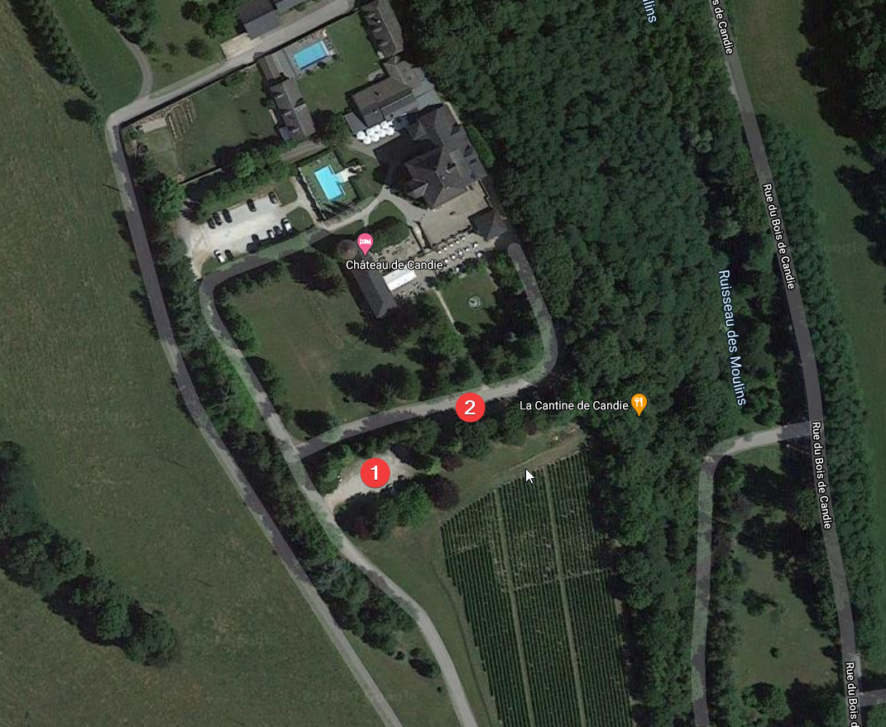

## Informations
### Générales
* Date : 10 Octobre 2020
* Lieu : Aix-les-bains

### Horaires
* Mairie : 15h00
* Eglise : 16h00
* Vin d'honneur: 18h00
* Repas : 20h00
* Brunch : J+1 - 10h30 (à partir)

## Plans
* Mairie : [accès](https://goo.gl/maps/R6U4dsQvcuyNdfWF9)
* Eglise : [accès](https://goo.gl/maps/LK823eEziKhxYFLA9)
* Réception : [accès](https://goo.gl/maps/UZDK3H4VH1zD5Bnc6)
* Cortège : [itinéraire](https://goo.gl/maps/wxhi3yV9Mt2a5HpZA)
  
## Informations pratiques 
* Se garer à Aix les bains :
  * Dans la rue (bonne chance!)
  * Parking Hôtel de Ville [accès](https://goo.gl/maps/EfZPtFjKQjKA7MbbA)
  * Parking Chaudanne [accès](https://goo.gl/maps/WXehe5SvGtBvJsx67)
* Se garer à l'église : 
  * Parking de la mairie : [accès](https://goo.gl/maps/5M69QH5jr4vfALxR7)
* Se garer au chateau : 
  * Privilégier les 2 premiers parkings 
  

